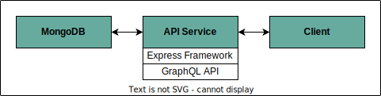
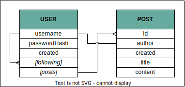

# A Microblogging API
A simple application intended to allow users to create text posts and/or subscribe to one 
another's feeds. This is _heavily_ work in progress and intentionally simple in scope.

This project has been built with the following technologies:

- `typescript` as its primary language.
- `express` as the main server framework.
- `graphql` + `graphql-http` for a GraphQL based API.
- `mongodb` for data storage. No ODM has been used.
- `mocha`, `chai` and `supertest` for testing.
- `bcrypt` for secure password hashing, and `jsonwebtoken` for token-based authorization.

**Note**: This is an example application built solely for the author's edification.
This is not meant to be taken as an example of a well-written project adhering to best practices.

## Applications

This API is intended to be able to serve as the back end for some application.
This could for example be a Single-Page App, for which the code itself could
easily be served from some index endpoint of the express router.

## API Feature List
Basic Functionality:

- [x] User Creation.
- [x] Login Process.
- [x] Create a new post, with bearer-based authorization.
- [x] Un/Follow a user.
- [x] View all posts from followed users.

## MongoDB Data Schema

### Legend
The formatting in the above diagram represents certain aspects of a given attribute.

- Regular attributes have no specific formatting;
-  <ins>primary key</ins>s are underlined;
- *foreign key*s are italicised;
- [array] attributes are surrounded with square brackets. 
  These contain multiple items, e.g. `posts` is an array of post IDs.

The models themselves are defined in [server/models](/server/models/).

## Building this project
- Make two copies of `.example.env` and rename these to `.env` and `.env.test` respectively. 
  Add appropriate values for the `PORT`, `MONGODB_URI` and `JWT_SECRET`. 
- Run `npm install`;
- Run `npm start`.